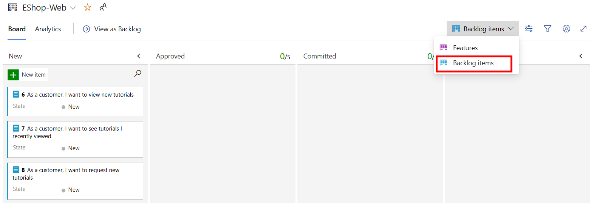

---
lab:
  title: Agile Planning and Portfolio Management with Azure Boards
  module: 'Module 01: Get started on a DevOps transformation journey'
---

# Agile Planning and Portfolio Management with Azure Boards

# Manual de laboratório do aluno

## Requisitos do laboratório

- Este laboratório requer o **Microsoft Edge** ou um [navegador com suporte do Azure DevOps.](https://docs.microsoft.com/azure/devops/server/compatibility?view=azure-devops#web-portal-supported-browsers)

- **Configurar uma organização do Azure DevOps:** se você ainda não tiver uma organização Azure DevOps que possa usar para este laboratório, crie uma seguindo as instruções disponíveis em [Criar uma organização ou coleção de projetos](https://docs.microsoft.com/azure/devops/organizations/accounts/create-organization?view=azure-devops).

## Visão geral do laboratório

Neste laboratório, você aprenderá sobre ferramentas de planejamento agile e processos de gerenciamento de portfólio fornecidos pelo Azure Boards e como elas podem ajudá-lo a planejar, gerenciar e acompanhar rapidamente o trabalho de toda a sua equipe. Você explorará a lista de pendências do produto, a lista de pendências de sprint e os quadros de tarefas que podem acompanhar o fluxo de trabalho durante uma iteração. Também examinaremos as ferramentas aprimoradas nesta versão para dimensionar para equipes e organizações maiores.

## Objetivos

Após concluir este laboratório, você poderá:

- Gerenciar equipes, áreas e iterações.
- Gerenciar itens de trabalho.
- Gerenciar sprints e capacidade.
- Personalizar quadros Kanban.
- Definir dashboards.
- Personalizar o processo de equipe.

## Tempo estimado: 60 minutos

## Instruções

### Exercício 0: configurar os pré-requisitos do laboratório

> **Observação**: se você já criou este projeto durante laboratórios anteriores, este exercício pode ser ignorado.

Neste exercício, você configurará os pré-requisitos para o laboratório, que consistem em um novo projeto do Azure DevOps com um repositório baseado no [eShopOnWeb](https://github.com/MicrosoftLearning/eShopOnWeb).

#### Tarefa 1: (pular se já feita) criar e configurar o projeto de equipe

Nesta tarefa, você criará um projeto **eShopOnWeb** do Azure DevOps para ser usado por vários laboratórios.

1. No computador do laboratório, em uma janela do navegador, abra sua organização do Azure DevOps. Clique em **Novo Projeto**. Dê ao projeto o nome **eShopOnWeb**. Defina **Privado** como opção de Visibilidade.
1. Clique em **Avançado** e especifique **Scrum** como **Processo de Item de Trabalho**.
 Clique em **Criar**.

    

### Exercício 1: gerenciar um projeto Agile

Neste exercício, você usará o Azure Boards para executar várias tarefas comuns de planejamento Agile e gerenciamento de portfólio, incluindo gerenciamento de equipes, áreas, iterações, itens de trabalho, sprints e capacidade, personalização de quadros Kanban, definição de dashboards e personalização de processos de equipe.

#### Tarefa 1: gerenciar equipes, áreas e iterações

Nesta tarefa, você criará uma nova equipe e configurará sua área e iterações.

Cada novo projeto é configurado com uma equipe padrão, cujo nome corresponde ao nome do projeto. Você tem a opção de criar equipes adicionais. Cada equipe pode ter acesso a um conjunto de ferramentas Agile e ativos de equipe. A capacidade de criar várias equipes oferece a flexibilidade de escolher o equilíbrio adequado entre autonomia e colaboração em toda a empresa.

1. Certifique-se de que o navegador da Web exiba a sua organização do Azure DevOps com o projeto **eShopOnWeb** gerado no exercício anterior.

    > **Observação**: Como alternativa, você pode acessar a página do projeto diretamente navegando até a URL [<https://dev.azure.com/>`<your-Azure-DevOps-account-name>`/eShopOnWeb), em que o espaço reservado `<your-Azure-DevOps-account-name>` representa o nome da sua conta.

1. Clique no ícone de engrenagem rotulado **Configurações do projeto** localizado no canto inferior esquerdo da página **Configurações do projeto**.

    

1. Na seção **Geral**, selecione a guia **Teams**. Já existe uma equipe padrão neste projeto, **Equipe do eShopOnWeb**, mas você criará uma nova para este laboratório. Clique em **Nova equipe**.

    

1. No painel **Criar uma nova equipe** na caixa de texto **Nome da equipe** digite, **EShop-Web**, deixe outras configurações com seus valores padrão e clique em **Criar**.

    

1. Na lista de **Equipes**, selecione a equipe recém-criada para exibir seus detalhes.

    > **Observação**: por padrão, a nova equipe tem apenas você como membro. Você pode usar esse modo de exibição para gerenciar funcionalidades como associação à equipe, notificações e dashboards.

1. Clique no **link Caminhos** de Área e Iterações na parte superior da **página do EShop-Web** para começar a definir a agenda e o escopo da equipe.

    

1. Na parte superior do painel **Boards** selecione a guia **Iterações** e, em seguida, clique em **+ Selecionar iteração(ões)**.

    

1. Selecione **eShopOnWeb\Sprint 1** e clique em **Salvar e fechar**. Observe que esse primeiro sprint aparecerá na lista de iterações, mas as Datas ainda não estão definidas.
1. Selecione **Sprint 1** e clique nas **reticências (...)**. No menu de contexto, selecione **Editar**.

     

    > **Observação**: especifique a Data de Início como o primeiro dia útil da semana passada e conte 3 semanas de trabalho completas para cada sprint. Por exemplo, se 6 de março é o primeiro dia útil do sprint, ele vai até 24 de março. A Sprint 2 começa em 27 de março, ou seja, 3 semanas a partir de 6 de março.

1. Repita a etapa anterior para adicionar **o Sprint 2** e **o Sprint 3**. Pode-se dizer que estamos na 2ª semana do primeiro sprint.

    

1. Ainda no painel **Configurações do Projeto / Boards / Configuração da Equipe**, na parte superior do painel, selecione a guia **Áreas**. Você encontrará uma área gerada automaticamente com o nome correspondente ao nome da equipe.

1. Clique no símbolo de reticências (...) ao lado da entrada de **área** padrão e, na lista suspensa, selecione **Incluir subáreas**.

    

    > **Observação**: a configuração padrão para todas as equipes é excluir caminhos de subárea. Vamos alterá-la para incluir subáreas para que a equipe tenha visibilidade de todos os itens de trabalho de todas as equipes. Opcionalmente, a equipe de gerenciamento também pode optar por não incluir subáreas, o que remove automaticamente os itens de trabalho de sua exibição assim que eles são atribuídos a uma das equipes.

#### Tarefa 2: gerenciar itens de trabalho

Nesta tarefa, você percorrerá tarefas comuns de gerenciamento de item de trabalho.

Os itens de trabalho desempenham um papel importante no Azure DevOps. Seja descrevendo o trabalho a ser feito, impedimentos à liberação, definições de teste ou outros itens-chave, os itens de trabalho são o cavalo de batalha dos projetos modernos. Nesta tarefa, você se concentrará em usar vários itens de trabalho para configurar o plano de estender o site Parts Unlimited com uma seção de treinamento de produto. Embora possa ser assustador criar uma parte tão substancial da oferta de uma empresa, o Azure DevOps e o processo Scrum o tornam muito gerenciável.

> **Observação**: esta tarefa foi projetada para ilustrar uma variedade de maneiras de criar diferentes tipos de itens de trabalho, bem como para demonstrar a amplitude de recursos disponíveis na plataforma. Como resultado, essas etapas não devem ser vistas como orientação prescritiva para o gerenciamento de projetos. Os recursos devem ser flexíveis o suficiente para atender às suas necessidades de processo, portanto, explore e experimente à medida que avança.

1. No painel de navegação vertical do portal do Azure DevOps, selecione o **ícone Boards** e selecione **Itens de Trabalho**.

    > **Observação**: há muitas maneiras de criar itens de trabalho no Azure DevOps e exploraremos algumas delas. Às vezes, é tão simples quanto disparar um de um dashboard.

1. Na janela Itens de **Trabalho** , clique em **+ Novo Item de Trabalho > Épico**.

    

1. **Na caixa de texto Inserir título**, digite **Treinamento do**produto.
1. No canto superior esquerdo, selecione a entrada **Não atribuída** e, na lista suspensa, selecione sua conta de usuário para atribuir o novo item de trabalho a você mesmo.
1. Ao lado da **entrada Área** , selecione a **entrada eShopOnWeb** e, na lista suspensa, selecione **EShop-WEB**. Isso definirá a **Área** como **eShopOnWeb\EShop-WEB.**
1. Ao lado da **entrada Interação** , selecione a **entrada eShopOnWeb** e, na lista suspensa, selecione **Sprint 2**. Isso definirá a **Interação** como **eShopOnWeb\Sprint 2**
1. Clique em **Salvar** para finalizar suas alterações. **Não o feche**.

    

    > **Observação**: normalmente, você preencheria o máximo de informações possível, mas isso é suficiente para os propósitos deste laboratório.

    > **Observação**: o formulário de item de trabalho inclui todas as configurações de item de trabalho relevantes. Isso inclui detalhes sobre a quem ele está atribuído, seu status em muitos parâmetros e todas as informações associadas e histórico de como ele foi tratado desde a criação. Uma das principais áreas a serem focadas é o **Trabalho**relacionado. Vamos explorar uma das maneiras de adicionar um recurso a este épico.

1. Na seção **Trabalho relacionado** no canto inferior direito, selecione a entrada **Adicionar link** e, na lista suspensa, selecione **Novo item**.
1. No painel **Adicionar link** na lista suspensa **Tipo de link** **selecione Filho**. Em seguida, na lista suspensa **Tipo de item de trabalho** selecione **Recurso**, na caixa de texto **Título** digite **Dashboard de treinamento** e clique em **OK**.

    

    > **Observação**: no painel **Dashboard de treinamento** observe que a atribuição, **a área**e a **Iteração** já estão definidas com os mesmos valores do épico no qual o recurso se baseia. Além disso, o recurso é vinculado automaticamente ao item pai a partir do qual foi criado.

1. Clique em **Adicionar link** para salvar o item Filho. No painel do **dashboard Treinamento** (Novo Recurso), clique em **Salvar e Fechar**.

1. No painel de navegação vertical do portal do Azure DevOps, na lista de itens Boards****, selecione **Boards**.
1. **No painel Boards**, selecione a **entrada Boards** EShop-WEB. Isso abrirá o board para aquela equipe em particular.

    

1. No painel **Boards**, no canto superior direito, selecione a entrada Lista de pendências** da ** e, na lista suspensa, selecione **Recursos**.

    > **Observação**: isso facilitará a adição de tarefas e outros itens de trabalho aos recursos.

1. Passe o ponteiro do mouse sobre o retângulo que representa o recurso Dashboard de**treinamento** . Isso revelará o símbolo de reticências (...) em seu canto superior direito.
1. Clique no ícone de reticências (...) e, na lista suspensa, selecione **Adicionar item** de lista de pendências do produto.

    

1. Na caixa de texto do novo item de lista de pendências do produto, digite **Como cliente, desejo exibir novos tutoriais** e pressione a tecla Enter** para salvar a **entrada.

    > **Observação**: isso cria um novo item de trabalho PBI (Product Backlog Item) que é filho do recurso e compartilha sua área e iteração.

1. Repita a etapa anterior para adicionar mais dois PBIs projetados para permitir que o cliente veja seus tutoriais exibidos recentemente e solicite novos tutoriais nomeados, respectivamente, **Como cliente, quero ver tutoriais que visualizei** recentemente e **Como cliente, desejo solicitar novos tutoriais**.

    

1. No painel **Boards**, no canto superior direito, selecione a entrada Recursos** **e, na lista suspensa, selecione **itens de lista de pendências**.

     

    > **Observação**: os itens da lista de pendências têm um estado que define onde eles estão em relação à conclusão. Embora você possa abrir e editar o item de trabalho usando o formulário, é mais fácil apenas arrastar cartões no board.

1. **Na guia Board** do **painel EShop-WEB**, arraste o primeiro item de trabalho chamado **Como cliente, desejo visualizar novos tutoriais** da **etapa Novo** para **Aprovado**.

    

    > **Observação**: você também pode expandir cartões de item de trabalho para obter detalhes convenientemente editáveis.

1. Passe o ponteiro do mouse sobre o retângulo que representa o item de trabalho movido para o **etapa Aprovado** . Isso revelará o símbolo do acento circunflexo voltado para baixo.
1. Clique no símbolo de acento circunflexo virado para baixo para expandir o cartão de item de trabalho, selecione a entrada Não atribuído** e, na lista de contas de usuário, selecione sua conta para atribuir o PBI movido a **si mesmo.
1. **Na guia Board** do **painel EShop-WEB**, arraste o segundo item de trabalho chamado **Como cliente, desejo visualizar novos tutoriais** da **etapa Novo** para **Confirmado**.
1. **Na guia Board** do **painel EShop-WEB**, arraste o terceiro item de trabalho chamado **Como cliente, desejo solicitar novos tutoriais** da **etapa Novo** para **Pronto**.

    

    > **Observação**: o quadro de tarefas é uma exibição na lista de pendências. Você também pode usar o modo de exibição tabular.

1. **Na guia Board** do **painel EShop-WEB**, na parte superior do painel, clique em **Exibir como pendência** para exibir o formulário tabular.

    

    > **Observação**: você pode usar o sinal de adição diretamente sob o **rótulo da guia pendência** do painel EShop-WEB** para exibir tarefas aninhadas nesses itens de **trabalho.

    > **Observação**: você pode usar o segundo sinal de adição diretamente à esquerda para o primeiro item de lista de pendências para adicionar uma nova tarefa a ele.

1. **Na guia Lista de pendências** do painel EShop-WEB **, no canto superior esquerdo do painel, clique no segundo sinal de adição na parte superior, aquele ao lado do **primeiro item de trabalho. Isso exibirá o **painel NOVA TAREFA** .

    

1. Na parte superior do **painel NOVA TAREFA** , na **caixa de texto Inserir título**, digite **Adicionar página para os tutoriais** mais recentes.
1. **No painel NOVA TAREFA**, na **caixa de texto Trabalho** Restante, digite **5**.
1. No painel **NOVA TAREFA,** na lista suspensa **Atividade** selecione **Desenvolvimento**.
1. No painel **NOVA TAREFA** clique em **Salvar e Fechar**.

    

1. Repita as últimas cinco etapas para adicionar outra tarefa chamada **Otimizar consulta de dados para os tutoriais mais recentes**. Defina seu **Trabalho Restante** como **3** e sua **Atividade** como **Design**. Clique em **Salvar e Fechar** depois de concluído.

#### Tarefa 3: gerenciar sprints e capacidade

Nesta tarefa, você percorrerá tarefas comuns de sprint e gerenciamento de capacidade.

O Teams cria a lista de pendências do sprint durante a reunião de planejamento de sprint, normalmente realizada no primeiro dia do sprint. Cada sprint corresponde a um intervalo fixo que dá suporte à capacidade da equipe de trabalhar usando processos e ferramentas Agile. Durante a reunião de planejamento, o proprietário do produto trabalha com sua equipe para identificar essas histórias ou itens da lista de pendências a serem concluídos no sprint.

O planejamento de reuniões normalmente consiste em duas partes. Na primeira parte, a equipe e o proprietário do produto identificam os itens da lista de pendências que a equipe acha que pode se comprometer a concluir no sprint, com base na experiência com sprints anteriores. Esses itens são adicionados à lista de pendências do sprint. Na segunda parte, a equipe determina como desenvolverá e testará cada item. Em seguida, eles definem e estimam as tarefas necessárias para concluir cada item. Por fim, a equipe se compromete a implementar alguns ou todos os itens com base nessas estimativas.

A lista de pendências do sprint deverá conter todas as informações de que a equipe precisa para concluir o trabalho com êxito dentro do tempo alocado sem precisar se apressar no final. Antes de planejar o sprint, você gostaria de ter criado, priorizado e estimado a lista de pendências e definido as sprints.

1. No painel de navegação vertical do portal do Azure DevOps, selecione o ícone **Boards** e, na lista de itens **Boards**, selecione **Sprints**.
1. Na guia **Quadro de Tarefas ** do modo de exibição **Sprints** na barra de ferramentas, no lado direito, selecione o **símbolo Opções de exibição** (diretamente à esquerda do ícone do funil) e, na lista suspensa **Opções de exibição** selecione a entrada **Detalhes do trabalho**. Selecione **Sprint 2** como filtro.

    

    > **Observação**: o sprint atual tem um escopo bastante limitado. Há duas tarefas na **etapa Fazer** . Até o momento, nenhuma tarefa foi atribuída. Ambos mostram um valor numérico à direita da entrada Não atribuída** que representa a estimativa de**trabalho restante.

1. Na coluna **ToDo**, observe que o item da tarefa **Adicionar página para obter os tutoriais mais recentes**, clique na entrada **Não atribuído** e, na lista de contas de usuário, selecione sua conta para atribuir a tarefa a você mesmo.

1. Selecione a **guia Capacidade** do modo de **** exibição Sprints.

    > **Note**: This view enables you to define what activities a user can take on and at what level of capacity.

1. Na guia **Capacidade** da exibição **Sprints**, clique em **+Adicionar usuário** e selecione sua conta de usuário. Para esse usuário, defina o campo **Atividade** como **Desenvolvimento** e, na caixa de texto **Capacidade por dia**, digite **1**.

    > **Observação**: isso representa 1 hora de trabalho de desenvolvimento por dia. Observe que você pode adicionar atividades adicionais por usuário caso eles façam mais do que apenas desenvolvimento.

    > **Note**: Let's assume you're also going to take some vacation. Which should be added to the capacity view too.

1. Na guia **Capacidade** do modo de exibição **Sprints**, diretamente ao lado da entrada que representa sua conta de usuário, na**a coluna Dias de folga,** clique na entrada **0 dias**. Isso exibirá um painel onde você pode definir seus dias de folga.
1. No painel exibido, use o modo de exibição de calendário para definir suas férias para abranger cinco dias úteis durante a sprint atual (nas próximas três semanas) e, depois de concluído, clique em **OK.**

    

1. De volta à guia **Capacidade** da visualização**Sprints**clique em **Salvar**.
1. Selecione o **guia Quadro de Tarefas** do modo de **** exibição Sprints.

    

    > **Observação**: observe que o painel Detalhes** do **trabalho foi atualizado para refletir a largura de banda disponível. O número real exibido no **painel Detalhes** do trabalho pode variar, mas sua capacidade total de sprint será igual ao número de dias úteis restantes até o final da sprint, já que você alocou 1 hora por dia. Anote esse valor, pois você o usará nas próximas etapas.

    > **Observação**: uma característica conveniente das placas é que você pode atualizar facilmente os principais dados em linha. É uma boa prática atualizar regularmente a estimativa de Trabalho**Restante para refletir a ** quantidade de tempo esperada para cada tarefa. Digamos que você tenha revisado o trabalho da tarefa Adicionar página para tutoriais** mais recentes e descoberto que ele realmente levará mais tempo do que o **esperado originalmente.

1. Na guia **Quadro de Tarefas** do modo de exibição **Sprints**, na caixa quadrada que representa a página **Adicionar para tutoriais mais recentes**, defina o número estimado de horas como **14**, para corresponder à sua capacidade total para essa sprint, que você identificou na etapa anterior.

    

    > **Observação**: isso expande automaticamente o **Desenvolvimento** e suas capacidades pessoais ao máximo. Como eles são grandes o suficiente para cobrir as tarefas atribuídas, eles permanecem verdes. No entanto, a capacidade geral **da equipe** é excedida devido às 3 horas adicionais exigidas pela consulta de dados Otimizar para a **tarefa de** tutoriais mais recentes.

    > **Observação**: uma maneira de resolver esse problema de capacidade seria mover a tarefa para uma iteração futura. Ele pode ser feito de várias maneiras. Você pode, por exemplo, abrir a tarefa aqui e editá-la no painel fornecendo acesso aos detalhes da tarefa. Outra abordagem seria usar a **visualização da lista de pendências** , que fornece uma opção de menu em linha para movê-la. Neste ponto, porém, não mova a tarefa ainda.

1. Na guia **Quadro de tarefas** da exibição **Sprints**, na barra de ferramentas, no lado direito, selecione o símbolo **Exibir opções** (diretamente à esquerda do ícone de funil) e, na lista suspensa **Exibir opções**, selecione a entrada **Atribuído a=**.

    > **Observação**: isso ajusta sua exibição de forma que você possa revisar o andamento das tarefas por pessoa, em vez de por item de lista de pendências.

    > **Observação**: há também muita personalização disponível.

1. Clique no **ícone Configurar engrenagem de configurações** da equipe (diretamente à direita do ícone do funil).
1. No painel **Configurações** selecione a guia **Estilos,** clique em **+ regra de estilo**, na etiqueta **Nome da regra,** na caixa de texto **Nome** digite **Desenvolvimento**, e, na lista suspensa **Cor do cartão** selecione o retângulo verde.

    > **Observação**: isso colorirá todos os cartões de verde se eles atenderem aos critérios de regra definidos diretamente abaixo, na seção Critérios de **regra** .

1. Na seção **Critérios de** regra, na **lista suspensa**, selecione **Atividade **, na lista suspensa**Operador**, selecione**=**, e, na lista suspensa **Valor** selecione **Desenvolvimento**.

    

    > **Observação**: isso definirá todos os cartões atribuídos às atividades de **desenvolvimento** em verde.

    

1. Na página **Configurações**, selecione a guia **Lista de pendências**.

    > **Observação**: as entradas nesta guia permitem que você defina os níveis disponíveis para navegação. Épicos não são incluídos por padrão, mas você pode alterar isso.

1. Na página **Configurações**, selecione a guia **Número de dias úteis**.

    > **Observação**: as entradas nesta guia permitem que você especifique os **dias úteis** que a equipe segue. Isso se aplica aos cálculos de capacidade e burndown.

1. Na página **Configurações**, selecione a guia **Trabalhando com bugs**.

    > **Observação**: as entradas nesta guia permitem que você especifique como os bugs são apresentados no quadro.

1. No painel **Configurações**, clique em **Salvar e fechar** para salvar a regra de estilo.

    > **Observação**: a tarefa associada ao **Desenvolvimento** é agora verde e muito fácil de identificar.

#### Tarefa 4: personalizar quadros Kanban

Nesta tarefa, você passará pelo processo de personalização de quadros Kanban.

Para maximizar a capacidade de uma equipe de fornecer consistentemente software de alta qualidade, o Kanban enfatiza duas práticas principais. A primeira, visualização do fluxo de trabalho, requer que você mapeie as etapas de fluxo de trabalho da sua equipe e configure um quadro Kanban para corresponder. A segunda, restrição da quantidade de trabalho em andamento, exige que você defina limites de WIP (Trabalho em andamento). Em seguida, você já poderá acompanhar o progresso em seu quadro Kanban e monitorar as principais métricas para reduzir o tempo de lead ou de ciclo. Seu quadro Kanban transforma sua lista de pendências em uma placa de sinalização interativa, fornecendo um fluxo visual de trabalho. À medida que o trabalho progride da ideia para a conclusão, você atualiza os itens no quadro. Cada coluna representa uma etapa de trabalho e cada cartão representa uma história de usuário (cartões azuis) ou um bug (cartões vermelhos) nessa etapa do trabalho. No entanto, cada equipe desenvolve seu próprio processo ao longo do tempo, portanto, a capacidade de personalizar o quadro Kanban para corresponder à maneira como sua equipe trabalha é fundamental para a entrega bem-sucedida.

1. No painel de navegação vertical do portal do Azure DevOps, na lista de itens Boards****, selecione **Boards**.
1. No painel **Boards**, clique no ícone de engrenagem **Definir configurações do quadro** (diretamente à direita do ícone de funil).

    > **Observação**: a equipe está enfatizando o trabalho feito com dados, portanto, há atenção especial dada a qualquer tarefa associada ao acesso ou armazenamento de dados.

1. No painel **Configurações** selecione a guia **Cores de marcação** clique em **+ Cor da marcação**, na caixa de texto **Marcação** digite **dados** e deixe a cor padrão no lugar.

    

    > **Observação**: sempre que um item de lista de pendências ou bug for marcado com **dados**, essa marcação será realçada.

1. Na engrenagem **Definir configurações do quadro**, no painel **Configurações**, selecione a guia **Anotações**.

    > **Observação**: você pode especificar quais **anotações** você gostaria de incluir nos cartões para torná-los mais fáceis de ler e navegar. Quando uma anotação é habilitada, os itens de trabalho filho desse tipo são facilmente acessíveis clicando na visualização em cada cartão.

1. Na página **Configurações**, selecione a guia **Lista de Testes**.

    > **Observação**: a guia **Testes** o habilitam a configurar como você deseja que os testes apareçam e se comportem nos cartões

1. No painel **Configurações**, clique em **Salvar e fechar** para salvar a regra de estilo.
1. Na guia **Quadro** do painel **EShop-WEB**, abra o Item de trabalho que representa o item da lista de pendências do produto **Como cliente, quero exibir novos tutoriais**.
1. Na exibição de item detalhado, na parte superior do painel, à direita da entrada **0 comentários**, clique em **Adicionar marca**.
1. Na caixa de texto resultante, digite **dados** e pressione a **tecla Enter** .
1. Repita a etapa anterior para adicionar a **marcação experiência do usuário** .
1. Salve essas edições clicando em **Salvar e Fechar**.

    

    > **Observação**: as duas marcações agora estão visíveis no cartão, com a marcações de dados** realçada **em amarelo conforme configurado.

1. No painel **Boards**, clique no ícone de engrenagem **Definir configurações do quadro** (diretamente à direita do ícone de funil).
1. Na página **Configurações**, selecione a guia **Lista de Colunas**.

    > **Observação**: Esta seção permite que você adicione novas etapas ao fluxo de trabalho.

1. Clique em **+ Coluna**, com **na etiqueta nome da Coluna**, na caixa de texto **Nome**, digite **QA Aprovado** e na caixa de texto **Limite de WIP **, digite **1**

    > **Observação**: o limite de trabalho em andamento de 1 indica que apenas um item de trabalho deve estar nesta etapa por vez. Normalmente, você definiria isso mais alto, mas há apenas dois itens de trabalho para demonstrar o recurso.

    

1. No painel **Configurações**, selecione a guia **Colunas** novamente. Observe as reticências ao lado da coluna **Garantia de qualidade aprovada** que você criou. Selecione **Mover para a direita** duas vezes, para que a coluna Garantia de qualidade aprovada seja posicionada entre **Confirmada** e **Concluída**.
1. No painel **Configurações**, clique em **Salvar**.

1. **Atualize** o **portal Boards**, de modo que a coluna **Garantia de qualidade aprovada** esteja visível na exibição do quadro Kanban agora.
1. Arraste o item de trabalho **Como cliente, quero desejo os tutoriais que visualizei recentemente** da etapa **Confirmado** para a **etapa QA Aprovado**.
1. Arraste o item de trabalho **Como cliente, desejo visualizar novos tutoriais** da etapa **Confirmado** para a **etapa Aprovado para o Controle de Qualidade**.

    

    > **Observação**: a etapa agora excede seu limite **WIP** e é colorida de vermelho como um aviso.

1. Mova o item de lista de pendência ** Como cliente, quero ver os tutoriais que visualizei recentemente** de volta para **Confirmado**.
1. No painel **Boards**, clique no ícone de engrenagem **Definir configurações do quadro** (diretamente à direita do ícone de funil).
1. No painel ** Configurações**, retorne à **guia Colunas** e selecione a **guia Aprovado** por controle de qualidade.

    > **Observação**: geralmente existe um atraso entre quando o trabalho é movido para uma coluna e quando o trabalho realmente é iniciado. Para combater esse atraso e revelar o estado real do trabalho em andamento, você pode ativar colunas divididas. Quando são divididas, cada coluna contém duas subcolunas, **Fazendo** e **Concluído**. As colunas divididas permitem que sua equipe implemente um modelo de pull. Sem dividir colunas, as equipes efetuam push do trabalho para a frente, para sinalizar que concluíram a etapa de trabalho. No entanto, empurrá-lo para a próxima etapa não significa necessariamente que um membro da equipe comece imediatamente a trabalhar nesse item.

1. Na guia QA **Aprovado** , habilite a caixa de **seleção Dividir coluna em fazer e concluído** para criar duas colunas separadas.

    > **Observação**: à medida que sua equipe atualiza o status do trabalho à medida que ele progride de uma etapa para a outra, é útil que eles concordem com o que **significa feito** . Ao especificar os **critérios Definição de concluído** para cada coluna Kanban, você ajuda a compartilhar as tarefas essenciais a serem concluídas antes de mover um item para uma etapa downstream.

1. Na guia QA **Aprovado** , na parte inferior do painel, na **caixa de texto Definição de concluído** , digite **Passa \*\*em todos os\*\* testes**.
1. No painel **Configurações**, clique em **Salvar e fechar**.

    

    > **Observação**: a **etapa Aprovado** pelo QA agora tem **as colunas Fazendo** e **Concluído** . Você também pode clicar no símbolo informativo (com a letra **i** em um círculo) ao lado do cabeçalho da coluna para ler a **Definição de concluído**.

1. No painel **Boards**, clique no ícone de engrenagem **Definir configurações dos quadros** (diretamente à direita do ícone de funil).

    > **Observação**: seu quadro Kanban suporta sua capacidade de visualizar o fluxo de trabalho à medida que ele passa do novo para o concluído. Ao adicionar **raias**, você também pode visualizar o status de trabalho que dá suporte a diferentes classes de nível de serviço. Você pode criar uma raia para representar qualquer outra dimensão que dê suporte às suas necessidades de acompanhamento.

1. No painel **Configurações,** selecione a guia **Raias**.
1. Na guia **Raias** clique em **+ Raia**, diretamente sob a etiqueta **Nome da raia, ** na caixa de texto **Nome** digite**Expedite**.
1. No painel **Configurações**, clique em **Salvar**.

    

1. De volta à guia **Board** do painel **Boards** arraste e solte o item de trabalho **Comprometido** na etapa **Fazendo Aprovado \| por QA** da raia **Expedite** para que ele seja reconhecido como tendo prioridade quando a largura de banda de QA estiver disponível.

#### Tarefa 5: personalizar processos da equipe

Nesta tarefa, criaremos um processo personalizado baseado em Scrum. O processo incluirá um campo de item de lista de pendências projetado para rastrear um ID de ticket proprietário do eShopOnWeb.

No Azure DevOps, você personaliza sua experiência de controle de trabalho por meio de um processo. Um processo define os blocos de construção do sistema de acompanhamento de itens de trabalho e outros subsistemas que você acessa por meio do Azure DevOps. Sempre que você cria um projeto de equipe, você seleciona o processo que contém os blocos de construção que você deseja para o seu projeto. O Azure DevOps dá suporte a dois tipos de processo. O primeiro, os principais processos do sistema (Scrum, Agile e CMMI) são somente leitura, portanto, você não pode personalizá-los. O segundo tipo, processos herdados, você cria com base nos principais processos do sistema, com a opção de personalizar suas configurações.

Todos os processos são compartilhados dentro da mesma organização. Ou seja, um ou mais projetos de equipe podem fazer referência a um único processo. Em vez de personalizar um único projeto de equipe, você personaliza um processo. As alterações feitas no processo atualizam automaticamente todos os projetos de equipe que fazem referência a esse processo. Depois de criar um processo herdado, você pode personalizá-lo, criar projetos de equipe com base nele e migrar projetos de equipe existentes para fazer referência a ele. O projeto de equipe do Git não pode ser personalizado até que seja migrado para um processo herdado.

1. Na página Azure DevOps, clique no logotipo do **Azure DevOps** no canto superior esquerdo para navegar até a página raiz da conta.
1. Clique no botão **Configuração da organização** no canto inferior esquerdo da página.
1. No menu vertical Configurações** da**Organização, na **seção Boards**, selecione **Processo**.
1. No painel Todos os **processos**, à direita da entrada do Scrum **, selecione o símbolo de **reticências (...) e, no menu suspenso, selecione **Criar processo** herdado.

    

1. **No painel Criar processo herdado do Scrum**, na caixa de **texto Nome do processo (obrigatório),** digite **Scrum** personalizado e clique em **Criar processo**.
1. De volta ao painel Todos os **processos**, clique na **entrada Scrum** personalizado.

    > **Observação**: talvez seja necessário atualizar o navegador para que o novo processo fique visível.

1. No painel Todos os **processos > Scrum** personalizado, selecione **Item** de lista de pendências do produto.

    

1. No painel Todos os **processos > Item de lista de pendências** personalizadas do Scrum > do produto, clique em **Novo campo**.
1. No painel **Adicionar um campo ao Item de Lista de Pendências do Produto**, na guia **Definição**, na seção **Criar um campo**, na caixa de texto **Nome**, digite **ID do Ticket EShop**.

    

1. **No painel Adicionar um campo ao Item** de Lista de Pendências do Produto, clique em **Layout**.
1. No painel **Adicionar um campo ao item da lista de pendências do produto**, na guia **Layout**, caixa de texto **Rótulo**, digite a **ID do tíquete**, selecione a opção **Criar um novo grupo**, na caixa de texto **Grupo**, digite **eShopOnWeb** e clique em **Adicionar campo**.

    

    > **Observação**: agora que o processo personalizado foi configurado, vamos alternar para o projeto eShopOnWeb para usá-lo.

1. Retorne à raiz **Todos os processos** usando o caminho de trilha na parte superior do painel **Todos os processos > Scrum personalizado > item de lista de pendências de produto**.
1. No painel **Todos os processos**, clique na **entrada Scrum** personalizado.

    

    > **Observação**: Nosso atual projeto usa **Scrum**.

1. No painel **Todos os processos > Scrum**, selecione a guia **Projetos**.
1. Na lista de projetos, na linha que contém a **entrada eShopOnWeb**, selecione o símbolo de reticências (...) e, em seguida, selecione **Alterar processo**.
1. No painel **Alterar o processo do projeto**, na lista suspensa **Selecionar um processo de destino**, selecione o processo **Scrum Personalizado**, clique em **Salvar** e, em seguida, clique em **Fechar**.

    

1. Clique no logotipo do **Azure DevOps** no canto superior esquerdo para navegar até a página raiz da conta.
1. **Na guia Projetos**, selecione a entrada que representa o **projeto eShopOnWeb**.
1. No menu vertical no lado esquerdo da página **eShopOnWeb** selecione **Boards** verifique se o painel **Itens de Trabalho** é exibido.
1. Na lista de itens de trabalho, clique no primeiro item de lista de pendências.
1. Verifique se agora você tem o **campo ID ** do ticket no grupo **eShopOnWeb** que foi definido durante a personalização do processo Você pode tratar isso como qualquer outro campo de texto.

    

    > **Observação**: depois que o item de trabalho for salvo, o Azure DevOps também salvará as novas informações personalizadas para que fiquem disponíveis para consultas e no restante do Azure DevOps.

### Exercício 2 (opcional): definir dashboards

Nesta tarefa, você passará pelo processo de criação de dashboards e seus componentes principais.

Os dashboards permitem que as equipes visualizem o status e monitorem o progresso em todo o projeto. Em resumo, você pode tomar decisões informadas sem ter que detalhar outras partes do site do seu projeto de equipe. A página Visão geral fornece acesso a um painel de equipe padrão que você pode personalizar adicionando, removendo ou reorganizando os blocos. Cada bloco corresponde a um widget que fornece acesso a um ou mais recursos ou funções.

1. No painel de navegação vertical do portal do Azure DevOps, selecione o ícone **Visão geral** e na lista de itens **Visão geral**, selecione **Dashboards**.
1. Se necessário, no painel **Dashboards** no canto superior esquerdo, na seção Equipe do **eShopOnWeb**, selecione **Equipe do eShopOnWeb - Visão Geral** e revise o dashboard existente.

    

1. **No painel Dashboards**, selecione o menu suspenso ao lado do **título Equipe eShopOnWeb - Visão geral** e selecione **+ Novo painel**.

    

1. No painel **Criar um dashboard**, na caixa de texto **Nome**, digite **Treinamento do produto**, na lista suspensa **Equipe**, selecione a equipe do **EShop-WEB**, e clique em **Criar**.

    

1. No novo painel do dashboard, clique em **Adicionar um widget**.
1. **No painel Adicionar widget**, na **caixa de texto Pesquisar**, digite **sprint** para localizar widgets existentes que se concentram em sprints. Na lista de resultados, selecione **Visão geral** da Sprint e clique em **Adicionar**.
1. No retângulo que representa o widget recém-adicionado, clique no ícone de engrenagem Configurações **** e revise o **painel Configuração**.

    > **Observação**: o nível de personalização varia de acordo com o widget.

1. **No painel Configuração**, clique em **Fechar** sem fazer alterações.
1. De volta ao **painel Adicionar widget**, na **caixa de texto Pesquisar**, digite **sprint** para localizar widgets existentes que se concentram em sprints. Na lista de resultados, selecione **Capacidade** da Sprint e clique em **Adicionar**.
1. **No modo de exibição Dashboard**, na parte superior do painel, clique em **Edição concluída**.

    

    > **Observação**: agora você pode revisar dois aspectos importantes do sprint atual no painel personalizado.

    > **Observação**: outra maneira de personalizar dashboards é gerar gráficos com base em consultas de item de trabalho, que você pode compartilhar com um painel.

1. No painel de navegação vertical do portal do Azure DevOps, selecione o ícone **Boards** e, na lista de itens **Boards**, selecione **Consultas**.
1. No painel **Consultas**, clique em **+ Nova Consulta**.
1. Na guia**Editor** do painel **Consultas > Minhas Consultas**, na lista suspensa **Valor** da linha **Tipo de item de trabalho **, selecione **a Tarefa**.
1. Na guia **Editor** de **Consultas > Minhas Consultas**, na segunda linha, na coluna **Campo**, selecione **Caminho da Área** e, na lista suspensa correspondente **Valor**, selecione **eShopOnWeb\\EShop-WEB**.
1. Clique em **Salvar consulta**

    

1. No painel **Nova consulta**, na caixa de texto**Inserir nome** digite **tarefas da Web **, na lista suspensa **Pasta**, selecione **Consultas compartilhadas**, e clique em **OK**.
1. Na exibição **Consultas > Consultas Compartilhadas**, selecione a guia **Gráficos** e clique em **+ Novo gráfico**.
1. No painel **Configurar gráfico**, na caixa de texto **Nome**, digite**Tarefas da Web – Por atribuição**, na lista suspensa **Agrupar por**, selecione**Atribuído a** e clique em **Salvar gráfico** para salvar as alterações.

    

    > **Observação**: agora você pode adicionar esse gráfico a um dashboard.

1. Retorne à seção **Dashboards** no menu **Visão geral**. Na seção **EShop-Web**, selecione o painel **Treinamento de produto** usado anteriormente para abri-lo.

1. No menu superior, clique em **Editar**. Na lista **Adicionar widget**, pesquise **Gráfico** e selecione **Gráfico de itens de trabalho**. Clique em **Adicionar** para adicionar esse widget ao dashboard do EShop-Web.

1. Clique na **configuração** (engrenagem) no **Gráfico de itens de trabalho** para abrir as configurações do widget.

1. Aceite o título como está. Em **Consulta**, selecione **Consultas compartilhadas / Tarefas da Web**. Mantenha o Tipo de gráfico como **Pizza**. Em **Agrupar por**, selecione **Atribuído a**. Mantenha os padrões de Agregação (Contagem) e Classificação (Valor/Crescente).

1. Confirme a configuração clicando em **Salvar**.

1. Observe que o gráfico de pizza dos resultados da consulta é mostrado no dashboard. **Salve** as alterações pressionando o botão **Edição concluída** na parte superior.

## Revisão

Neste exercício, você usou o Azure Boards para executar várias tarefas comuns de planejamento ágil e gerenciamento de portfólio, incluindo gerenciamento de equipes, áreas, iterações, itens de trabalho, sprints e capacidade, personalização de quadros Kanban, definição de dashboards e personalização de processos de equipe.
