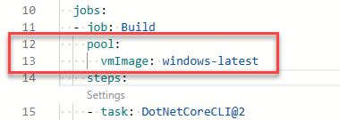

---
lab:
  title: Configurar pools de agentes e entender os estilos de pipeline
  module: 'Module 03: Implement CI with Azure Pipelines and GitHub Actions'
---

# Configurar pools de agentes e entender os estilos de pipeline

## Manual de laboratório do aluno

## Requisitos do laboratório

- Este laboratório requer o **Microsoft Edge** ou um [navegador com suporte do Azure DevOps.](https://docs.microsoft.com/azure/devops/server/compatibility)

- **Configurar uma organização do Azure DevOps:** se você ainda não tiver uma organização Azure DevOps que possa usar para este laboratório, crie uma seguindo as instruções disponíveis em [Criar uma organização ou coleção de projetos](https://docs.microsoft.com/azure/devops/organizations/accounts/create-organization).

- [Página de download do Git for Windows](https://gitforwindows.org/). Ele será instalado como parte dos pré-requisitos deste laboratório.

- [Visual Studio Code](https://code.visualstudio.com/). Ele será instalado como parte dos pré-requisitos deste laboratório.

## Visão geral do laboratório

Os pipelines baseados em YAML permitem que você implemente totalmente CI/CD como código, em que as definições de pipeline residem no mesmo repositório que o código que faz parte do seu projeto do Azure DevOps. Os pipelines baseados em YAML dão suporte a uma ampla variedade de recursos que fazem parte dos pipelines clássicos, como solicitações de pull, revisões de código, histórico, branch e modelos.

Independentemente da escolha do estilo de pipeline, para criar seu código ou implantar sua solução usando o Azure Pipelines, você precisa de um agente. Um agente hospeda recursos de computação que executam um trabalho por vez. Os trabalhos podem ser executados diretamente no computador host do agente ou em um contêiner. Você pode executar seus trabalhos usando agentes hospedados pela Microsoft, que são gerenciados para você, ou implementar um agente auto-hospedado que você configura e gerencia por conta própria.

Neste laboratório, você aprenderá a implementar e usar agentes auto-hospedados com pipelines YAML.

## Objetivos

Após concluir este laboratório, você poderá:

- Implementar pipelines baseados em YAML.
- Implementar agentes auto-hospedados.

## Tempo estimado: 45 minutos

## Instruções

### Exercício 0: configurar os pré-requisitos do laboratório

Neste exercício, você configurará os pré-requisitos para o laboratório, que consistem em um novo projeto do Azure DevOps com um repositório baseado no [eShopOnWeb](https://github.com/MicrosoftLearning/eShopOnWeb).

#### Tarefa 1: (pular se feita) criar e configurar o projeto de equipe

Nesta tarefa, você criará um projeto **eShopOnWeb** do Azure DevOps para ser usado por vários laboratórios.

1. No computador do laboratório, em uma janela do navegador, abra sua organização do Azure DevOps. Clique em **Novo projeto**. Dê ao seu projeto o nome **eShopOnWeb** e deixe os outros campos com padrões. Clique em **Criar**.

#### Tarefa 2: (pular se feita) importar repositório do Git eShopOnWeb

Nesta tarefa, você importará o repositório eShopOnWeb do Git que será usado por vários laboratórios.

1. No computador do laboratório, em uma janela do navegador, abra sua organização do Azure DevOps e o projeto **eShopOnWeb** criado anteriormente. Clique em **Repos>Arquivos**, **Importar um repositório**. Selecione **Importar**. Na janela **Importar um repositório do Git**, cole a seguinte URL https://github.com/MicrosoftLearning/eShopOnWeb.git e clique em **Importar**:

2. O repositório está organizado da seguinte forma:
    - A pasta **.ado** contém os pipelines YAML do Azure DevOps.
    - O contêiner da pasta **.devcontainer** está configurado para o desenvolvimento usando contêineres (localmente no VS Code ou no GitHub Codespaces).
    - A pasta **.azure** contém a infraestrutura Bicep e ARM como modelos de código usados em alguns cenários de laboratório.
    - A pasta **.github** contém definições de fluxo de trabalho do GitHub YAML.
    - A pasta **src** contém o site do .NET 7 usado nos cenários do laboratório.

### Exercício 1: criar Azure Pipelines baseado em YAML

Neste exercício, você criará um pipeline de build do ciclo de vida do aplicativo usando um modelo baseado em YAML.

#### Tarefa 1: criar um pipeline YAML do Azure DevOps

Nesta tarefa, você criará um pipeline YAML do Azure DevOps baseado em modelo.

1. No navegador da Web que exibe o portal do Azure DevOps com o projeto **EShopOnWeb** aberto, no painel de navegação vertical no lado esquerdo, clique em **Pipelines**.
2. Clique no botão **Criar pipeline** se você ainda não tiver nenhum outro pipeline criado ou clique em **Novo pipeline** para criar um novo. 

3. Na página **Onde está seu código?**, clique em **Azure Repos Git **.
4. **No painel Selecionar um repositório**, clique em **EShopOnWeb**.
5. Na tela **Configurar o pipeline**, selecione **Arquivo YAML existente do Azure Pipelines**.
6. Em **Selecionar um arquivo YAML existente**, selecione **main** para Branch e **/.ado/eshoponweb-ci-pr.yml** para o caminho.
7. Clique em **Continuar**.
8. No painel **Revisar seu pipeline YAML**, revise o pipeline de exemplo. Este é um pipeline de build de aplicativo .NET bastante simples, que faz o seguinte:
- Um único estágio: Compilar
- Um único trabalho: Build
- Três tarefas dentro trabalho de build:
- Dotnet Restore
- Dotnet Build
- Dotnet Publish

9. No painel **Revisar seu pipeline YAML**, clique no símbolo de acento circunflexo para baixo ao lado do botão **Executar**, clique em **Salvar**.

    > Observação: estamos apenas criando a definição de pipeline por enquanto, sem executá-la. Primeiro, você configurará um pool de agentes do Azure DevOps e executará o pipeline em um exercício posterior. 

### Exercício 2: gerenciar pools de agentes do Azure DevOps

Neste exercício, você implementará um agente de DevOps do Azure auto-hospedado.

#### Tarefa 1: configurar um agente auto-hospedado do Azure DevOps

Nesta tarefa, você configurará sua Máquina Virtual de laboratório como um agente auto-hospedado do Azure DevOps e a usará para executar um pipeline de build.

1. Na máquina Virtual do Laboratório (VM do laboratório) ou em seu próprio computador, inicie um navegador da Web, navegue até o [portal do Azure DevOps](https://dev.azure.com) e entre usando a conta da Microsoft associada à sua organização Azure DevOps.

  > **Observação**: a máquina virtual do laboratório deve ter todo os softwares de pré-requisito necessários instalados. Se você estiver instalando em seu próprio computador, será necessário instalar os SDKs do .NET 7.0.x ou superior necessários para criar o projeto de demonstração. Confira [Download do .NET](https://dotnet.microsoft.com/download/dotnet).

1. No portal do Azure DevOps, no canto superior direito da página Azure DevOps, clique no ícone **Configurações de usuário**. Dependendo se você tiver ou não recursos de visualização ativados, você verá um item de **tokens de acesso de segurança** ou **pessoal** no menu. Se você vir **Segurança**, clique nele e selecione **Tokens de acesso pessoal**. No painel **Tokens de Acesso Pessoal** e clique em **+ Novo Token**.
2. No painel **Criar um novo token de acesso pessoal**, clique no link **Mostrar todos os escopos** e especifique as seguintes configurações e clique em **Criar** (deixe todos os outros com seus valores padrão):

    | Configuração | Valor |
    | --- | --- |
    | Nome | **EShopOnWeb** |
    | Escopo (personalizado definido) | **Pools de agentes** (mostrar mais escopos abaixo, se necessário)|
    | Permissões | **Ler e gerenciar** |

3. No painel **Êxito**, copie o valor do token de acesso pessoal para a área de transferência.

    > **Observação**: certifique-se de copiar o token. Você não poderá recuperá-lo depois de fechar este painel.

4. No painel **Êxito**, clique em **Fechar**.
5. No painel **Token de Acesso Pessoal** do portal do Azure DevOps, clique no símbolo **Azure DevOps** no canto superior esquerdo e, em seguida, clique em **Rótulo de configurações** da organização no canto inferior esquerdo.
6. No lado esquerdo do painel **Visão geral**, no menu vertical, na seção **Pipelines**, clique em **Pools de agentes**.
7. No painel **Pools de agentes**, no canto superior direito, clique em **Adicionar pool**.
8. No painel **Adicionar pool de agentes**, na lista suspensa **Tipo de pool**, selecione **Auto-hospedado**. Na caixa de texto **Nome**, digite **az400m03l03a-pool** e clique em **Criar**.
9.  De volta ao painel **Pools de agentes**, clique na entrada que representa o **az400m03l03a-pool** recém-criado.
10. Na guia **Trabalhos** do painel **az400m03l03a-pool**, clique no botão **Novo agente**.
11. No painel **Obter o agente**, verifique se as guias **Windows** e **x64** estão selecionadas e clique em **Baixar** para baixar o arquivo zip que contém os binários do agente para baixá-lo na pasta **Downloads** local dentro do seu perfil de usuário.

    > **Observação**: se você receber uma mensagem de erro neste momento indicando que as configurações atuais do sistema impedem que você baixe o arquivo, na janela Navegador, no canto superior direito, clique no símbolo de engrenagem que designa o cabeçalho do menu **Configurações**. No menu suspenso, selecione **Opções da Internet**. Na caixa de diálogo **Opções da Internet**, clique em **Avançado**. Na guia **Avançado**, clique em **Redefinir**. Na caixa de diálogo **Redefinir Configurações do Navegador**, clique em **Redefinir** novamente, clique em **Fechar** e tente baixar novamente.

12. Inicie o Windows PowerShell como administrador e, no console **Administrador: Windows PowerShell**, execute as seguintes linhas para criar o **diretório C:\\agent** e extrair o conteúdo do arquivo baixado nele.

    ```powershell
    cd \
    mkdir agent ; cd agent
    $TARGET = Get-ChildItem "$Home\Downloads\vsts-agent-win-x64-*.zip"
    Add-Type -AssemblyName System.IO.Compression.FileSystem
    [System.IO.Compression.ZipFile]::ExtractToDirectory($TARGET, "$PWD")
    ```

14. No mesmo console do **Administrador: Windows PowerShell**, execute o seguinte para configurar o agente:

    ```powershell
    .\config.cmd
    ```

15. Quando solicitado, especifique os valores das seguintes configurações:

    | Configuração | Valor |
    | ------- | ----- |
    | Inserir o servidor de URL | a URL da sua organização do Azure DevOps, no formato **<https://dev.azure.com/>`<organization_name>`**, em que `<organization_name>` representa o nome da sua organização do Azure DevOps |
    | Inserir o tipo de autenticação (pressione Enter para PAT) | **Enter** |
    | Inserir o token de acesso pessoal | O token de acesso que você registrou anteriormente nesta tarefa |
    | Inserir o pool de agentes (pressione Enter para padrão) | **az400m03l03a-pool** |
    | Inserir o nome do agente | **az400m03-vm0** |
    | Inserir pasta de trabalho (pressione Enter para _work) | **Enter** |
    | **(Somente se exibida)** Inserir Executar um descompactamento para tarefas para cada etapa. (pressione Enter para N) | **AVISO**: aperte **Enter** somente se a mensagem for exibida|
    | Inserir agente de execução como serviço? (S/N) (pressione Enter para N) | **Y** |
    | inserir habilitar SERVICE_SID_TYPE_UNRESTRICTED (Y/N) (aperte enter para N) | **Y** |
    | Inserir Conta de usuário a ser usada para o serviço (pressione Enter para NT AUTHORITY\NETWORK SERVICE) | **Enter** |
    | Digite se deseja impedir que o serviço seja iniciado imediatamente após a conclusão da configuração? (S/N) (pressione Enter para N) | **Enter** |

    > **Observação**: você pode executar seu agente auto-hospedado como um serviço ou um processo interativo. Talvez você queira começar com o modo interativo, pois isso simplifica a verificação da funcionalidade do agente. Para uso em produção, você deve considerar a execução do agente como um serviço ou como um processo interativo com logon automático habilitado, já que ambos mantêm o estado de execução e garantem que o agente seja iniciado automaticamente se o sistema operacional for reiniciado.

16. Mude para a janela do navegador que exibe o portal do Azure DevOps e feche o painel **Obter o agente**.
17. De volta à guia **Agentes** do painel **az400m03l03a-pool**, observe que o agente recém-configurado é listado com o status **Online**.
18. Na janela do navegador da Web que exibe o portal do Azure DevOps, no canto superior esquerdo, clique na etiqueta **Azure DevOps**.
19. Na lista de projetos, clique no bloco que representa o projeto **EShopOnWeb**.
20. No painel **EShopOnWeb**, no painel de navegação vertical do lado esquerdo, na seção **Pipelines**, clique em **Pipelines**.
21. Na guia **Recente** do painel **Pipelines**, selecione **EShopOnWeb** e, no painel **EShopOnWeb**, selecione **Editar**.
22. No painel de edição **EShopOnWeb**, no pipeline existente baseado em YAML, substitua a linha 13 que diz `vmImage: windows-latest` designando o pool de agentes de destino com o seguinte conteúdo, designando o pool de agentes auto-hospedado recém-criado:

    ```yaml
    name: az400m03l03a-pool
    demands:
    - Agent.Name -equals az400m03-vm0
    ```

    > **AVISO**: tenha cuidado com copiar/colar. Confirme se o recuo é o mesmo mostrado acima.

    

23. No painel editar **EShopOnWeb**, no canto superior direito do painel, clique em **Salvar e Executar**. Isso vai disparar automaticamente o build com base nesse pipeline.
24. No portal de DevOps do Azure, no painel de navegação vertical no lado esquerdo, na seção **Pipelines**, clique em **Pipelines**. Dependendo da configuração do laboratório, o pipeline pode solicitar permissões. Clique em **Permitir** para permitir que o pipeline seja executado. 
25. Na guia **Recente** do painel **Pipelines**, clique na entrada **EShopOnWeb**. Na guia **Execuções** do painel **EShopOnWeb**, selecione a execução mais recente. No painel **Resumo da execução**, role para baixo até a parte inferior. Na seção **Trabalhos**, clique em **Fase 1** e monitore o trabalho até sua conclusão bem-sucedida.

### Exercício 3: remover os recursos usados neste laboratório

1. Interrompa e remova o serviço do agente executando `.\config.cmd remove` a partir do prompt de comando.
2. Exclua o pool de agentes.
3. Revogue o token PAT.
4. Reverta as alterações no arquivo **eshoponweb-ci-pr.yml** navegando até ele de Repos/.ado/eshoponweb-ci-pr.yml, selecionando **Editar** e removendo as linhas 13-15 (o snippet de pool do agente) e voltando para `vmImage: windows-latest` como era originalmente. (Isso ocorre porque você usará o mesmo arquivo de pipeline de exemplo em um exercício de laboratório futuro.) 



## Revisão

Neste laboratório, você aprendeu a implementar e usar agentes auto-hospedados com pipelines YAML.
