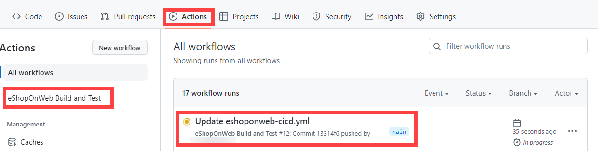

---
lab:
  title: Implementar o GitHub Actions para CI/CD
  module: 'Module 03: Implement CI with Azure Pipelines and GitHub Actions'
---

# Implementar o GitHub Actions para CI/CD

## Manual de laboratório do aluno

## Requisitos do laboratório

- Este laboratório requer o **Microsoft Edge** ou um [navegador com suporte do Azure DevOps](https://docs.microsoft.com/azure/devops/server/compatibility).

- Identifique uma assinatura existente do Azure ou crie uma.

- Verifique se você tem uma conta Microsoft ou uma conta do Microsoft Entra com a função de Colaborador ou Proprietário na assinatura do Azure. Para obter detalhes, veja [Listar designações de função do Azure usando o portal do Azure](https://docs.microsoft.com/azure/role-based-access-control/role-assignments-list-portal) e [Exibir e designar funções de administrador no Azure Active Directory](https://docs.microsoft.com/azure/active-directory/roles/manage-roles-portal).

- **Se você ainda não tem uma conta do GitHub** que possa usar para este laboratório, siga as instruções disponíveis em [Como se inscrever em uma nova conta do GitHub](https://github.com/join) para criar uma.

## Visão geral do laboratório

Neste laboratório, você aprenderá a implementar um fluxo de trabalho do GitHub Action que implanta um aplicativo Web do Azure.

## Objetivos

Após concluir este laboratório, você poderá:

- Implementar um fluxo de trabalho do GitHub Actions para CI/CD.
- Explicar as características básicas dos fluxos de trabalho do GitHub Action.

## Tempo estimado: 40 minutos

## Instruções

### Exercício 0: importar o eShopOnWeb para o repositório GitHub

Neste exercício, você importará o código do repositório [eShopOnWeb](https://github.com/MicrosoftLearning/eShopOnWeb) existente para seu próprio repositório privado do GitHub.

O repositório está organizado da seguinte forma:
    - A pasta **.ado** contém os pipelines YAML do Azure DevOps.
    - O contêiner da pasta **.devcontainer** está configurado para o desenvolvimento usando contêineres (localmente no VS Code ou no GitHub Codespaces).
    - A pasta **.azure** contém a infraestrutura Bicep&ARM como modelos de código usados em alguns cenários de laboratório.
    - A pasta **.github** contém definições de YAML do fluxo de trabalho do GitHub.
    - A pasta **src** contém o site do .NET 6 usado nos cenários do laboratório.

#### Tarefa 1: criar um repositório público no GitHub e importar o eShopOnWeb

Nesta tarefa, você criará um repositório do GitHub público vazio e importará o repositório [eShopOnWeb](https://github.com/MicrosoftLearning/eShopOnWeb) existente.

1. No computador do laboratório, inicie um navegador da Web, navegue até o [site do GitHub](https://github.com/), entre usando sua conta e clique em **Novo** para criar um novo repositório.

    

2. Na página **Criar novo repositório**, clique no link **Importar um repositório** (abaixo do título da página).

    > OBSERVAÇÃO: você também pode abrir o site de importação diretamente em https://github.com/new/import

3. Na página **Importar seu projeto para o GitHub**:

    | Campo | Valor |
    | --- | --- |
    | URL de clone do seu repositório antigo| https://github.com/MicrosoftLearning/eShopOnWeb |
    | Proprietário | O alias da sua conta |
    | Nome do repositório | eShopOnWeb |
    | Privacidade | **Público** |

4. Clique em **Começar importação** e espere o repositório ficar pronto.

5. Na página do repositório, vá para **Configurações**, clique em **Ações > Geral** e escolha a opção **Permitir todas as ações e fluxos de trabalho reutilizáveis**. Clique em **Salvar**.

    

### Exercício 1: configurar o repositório GitHub e o acesso ao Azure

Neste exercício, você criará uma Entidade de Serviço do Azure para autorizar o GitHub acessando sua assinatura do Azure no GitHub Actions. Você também configurará o fluxo de trabalho do GitHub que criará, testará e implantará seu site no Azure.

#### Tarefa 1: criar uma entidade de serviço do Azure e salvá-la como segredo do GitHub

Nesta tarefa, você criará a Entidade de Serviço do Azure usada pelo GitHub para implantar os recursos desejados. Como alternativa, você também pode usar o [OpenID Connect no Azure](https://docs.github.com/actions/deployment/security-hardening-your-deployments/configuring-openid-connect-in-azure), como um mecanismo de autenticação sem segredo.

1. No computer do laboratório, abra o Portal do Azure (https://portal.azure.com/)) em uma janela do navegador.
2. No portal, procure **Grupos de Recursos** e clique nele.
3. Clique em **+ Criar** para criar um novo Grupo de Recursos para o exercício.
4. Na guia **Criar um grupo de recursos**, dê o seguinte nome ao seu Grupo de Recursos:**rg-az400-eshoponweb-NAME** (substitua NAME por algum alias exclusivo). Clique em **Revisar+Criar > Criar**.
5. No Portal do Azure, abra o **Cloud Shell** (ao lado da barra de pesquisa).

    > OBSERVAÇÃO: se esta é a primeira vez que você abre o Cloud Shell, você precisa configurar o [armazenamento persistente](https://learn.microsoft.com/azure/cloud-shell/persisting-shell-storage)

6. Verifique se o terminal está sendo executado no modo **Bash** e execute o seguinte comando, substituindo **SUBSCRIPTION-ID** e **RESOURCE-GROUP** por seus próprios identificadores (ambos podem ser encontrados na página **Visão geral** do Grupo de recursos):

    `az ad sp create-for-rbac --name GH-Action-eshoponweb --role contributor --scopes /subscriptions/SUBSCRIPTION-ID/resourceGroups/RESOURCE-GROUP --sdk-auth`

    > OBSERVAÇÃO: certifique-se de que isto está escrito ou colado como uma única linha!
    > OBSERVAÇÃO: este comando criará uma Entidade de serviço com acesso de Colaborador para o grupo de recursos criado antes. Dessa forma, garantimos que o GitHub Actions terá apenas as permissões necessárias para interagir somente com esse Grupo de Recursos (não com o restante da assinatura)

7. O comando produzirá um objeto JSON, você o usará posteriormente como um segredo do GitHub para o fluxo de trabalho. Copie o JSON. O JSON contém os identificadores usados para autenticar no Azure em nome de uma identidade do Microsoft Entra (entidade de serviço).

    ```JSON
        {
            "clientId": "<GUID>",
            "clientSecret": "<GUID>",
            "subscriptionId": "<GUID>",
            "tenantId": "<GUID>",
            (...)
        }
    ```
8. Você também precisa executar o seguinte comando para registrar o provedor de recursos para o **Serviço de Aplicativo do Azure** que você implantará posteriormente:
   ```bash
   az provider register --namespace Microsoft.Web
   ``` 
10. Em uma janela do navegador, volte para o repositório do GitHub **eShopOnWeb**.
11. Na página do repositório, vá para **Configurações**, clique em **Segredos e variáveis > Ações**. Clique em **Novo segredo do repositório**
    - Nome : **AZURE_CREDENTIALS**
    - Segredo: **cole o objeto JSON copiado anteriormente** (o GitHub é capaz de manter vários segredos com o mesmo nome, usados pela ação [azure/login](https://github.com/Azure/login) )

12. Clique em **Adicionar segredo**. Agora, o GitHub Actions poderá fazer referência à entidade de serviço, usando o segredo do repositório.

#### Tarefa 2: modificar e executar o fluxo de trabalho do GitHub

Nesta tarefa, você modificará o fluxo de trabalho do GitHub fornecido e o executará para implantar a solução em sua própria assinatura.

1. Em uma janela do navegador, volte para o repositório do GitHub **eShopOnWeb**.
2. Na página do repositório, vá para **Código** e abra o seguinte arquivo: **eShopOnWeb/.github/workflows/eshoponweb-cicd.yml**. Esse fluxo de trabalho define o processo de CI/CD para o código de site do .NET 7 fornecido.
3. Remova o comentário da seção **on** (exclua "#"). O fluxo de trabalho é acionado a cada push para o branch main e também oferece acionamento manual ("workflow_dispatch").
4. Na seção **env**, faça as seguintes alterações:
    - Substitua **NAME** na variável **RESOURCE-GROUP** . Deve ser o grupo de recursos criado em etapas anteriores.
    - (Opcional) Você pode escolher sua [ região do Azure](https://azure.microsoft.com/explore/global-infrastructure/geographies) mais próxima para **LOCATION**. For example, "eastus", "eastasia", "westus", etc.
    - Substitua **YOUR-SUBS-ID** em **SUBSCRIPTION-ID**.
    - Substitua **NAME** em **WEBAPP-NAME** por algum alias exclusivo. Ele será usado para criar um site globalmente exclusivo usando o Serviço de Aplicativo do Azure.
5. Leia o fluxo de trabalho com atenção. Comentários são fornecidos para ajudar a entender.

6. Clique em **Iniciar commit** e **Confirmar Alterações**, deixando os padrões (alterando o branch main). O fluxo de trabalho será executado automaticamente.

#### Tarefa 3: revisar a execução do fluxo de trabalho do GitHub

Nesta tarefa, você analisará a execução do fluxo de trabalho do GitHub:

1. Em uma janela do navegador, volte para o repositório do GitHub **eShopOnWeb**.
2. Na página do repositório, acesse **Ações**, você verá a configuração do fluxo de trabalho antes de executar. Clique nele.

    

3. Aguarde o fim da execução do fluxo de trabalho. Em **Resumo**, você pode ver os dois trabalhos de fluxo de trabalho, o status e os Artefatos retidos na execução. Você pode clicar em cada trabalho para revisar os logs.

    

4. Em uma janela do navegador, volte para o portal do Azure (https://portal.azure.com/). Abra o grupo de recursos criador anteriormente. Você verá que o GitHub Actions, usando um modelo Bicep, criou um Plano do Serviço de Aplicativo do Azure + Serviço de Aplicativo. Você pode ver o site publicado abrindo o Serviço de Aplicativo e clicando em **Procurar**.

    

#### (OPCIONAL) Tarefa 4: adicionar pré-implantação de aprovação manual usando ambientes do GitHub

Nesta tarefa, você usará ambientes do GitHub para solicitar aprovação manual antes de executar as ações definidas no trabalho de implantação do seu fluxo de trabalho.

1. Na página do repositório, vá para **Código** e abra o seguinte arquivo: **eShopOnWeb/.github/workflows/eshoponweb-cicd.yml**.
2. Na seção de trabalho de **implantação**, você pode encontrar uma referência a um **ambiente** chamado **Desenvolvimento**. Os [ambientes](https://docs.github.com/en/actions/deployment/targeting-different-environments/using-environments-for-deployment) usados pelo GitHub adicionam regras de proteção (e segredos) para seus destinos.

3. Na página do repositório, vá para **Configurações**, abra **Ambientes** e clique em **Novo ambiente**.
4. Dê o nome de **Desenvolvimento** e clique em **Configurar Ambiente**.

    > OBSERVAÇÃO: se um ambiente chamado **Desenvolvimento** já existir na lista **Ambientes**, abra a configuração clicando no nome do ambiente.  
    
5. Na guia **Configurar Desenvolvimento**, marque a opção **Revisores Necessários** e sua conta do GitHub como revisor. Clique em **Salvar regras de proteção**.
6. Agora vamos testar a regra de proteção. Na página do repositório, vá para **Ações**, clique no fluxo de trabalho **Criar e testar eShopOnWeb** e clique em **Executar fluxo de trabalho>Executar fluxo de trabalho** para executar manualmente.

    

7. Clique na execução iniciada do fluxo de trabalho e aguarde a conclusão do trabalho **buildandtest**. Você verá uma solicitação de revisão quando o trabalho de **implantação** for alcançado.

8. Clique em **Revisar implantações**, marque **Desenvolvimento** e clique em **Aprovar e implantar**.

    

9. O fluxo de trabalho seguirá a execução e a conclusão do trabalho de **implantação**.

### Exercício 2: remover os recursos do laboratório do Azure

Neste exercício, você usará o Azure Cloud Shell para remover os recursos do Azure provisionados neste laboratório para eliminar cobranças desnecessárias.

1. No portal do Azure, abra a sessão **Bash** no painel **Cloud Shell**.
2. Liste todos os grupos de recursos criados nos laboratórios deste módulo executando o seguinte comando:

    ```sh
    az group list --query "[?starts_with(name,'rg-az400-eshoponweb')].name" --output tsv
    ```

3. Exclua todos os grupos de recursos criados em todos os laboratórios deste módulo executando o seguinte comando:

    ```sh
    az group list --query "[?starts_with(name,'rg-az400-eshoponweb')].[name]" --output tsv | xargs -L1 bash -c 'az group delete --name $0 --no-wait --yes'
    ```

    >**Observação**: o comando é executado de modo assíncrono (conforme determinado pelo parâmetro --nowait), portanto, embora você possa executar outro comando da CLI do Azure imediatamente depois na mesma sessão Bash, levará alguns minutos antes de o grupo de recursos ser removido.

## Revisão

Neste laboratório, você implementou um fluxo de trabalho do GitHub Actions que implanta um aplicativo Web do Azure.
