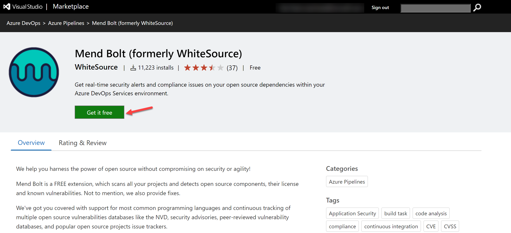

---
lab:
  title: Implementar segurança e conformidade em um pipeline do Azure DevOps
  module: 'Module 07: Implement security and validate code bases for compliance'
---

# Implementar segurança e conformidade em um pipeline do Azure DevOps

## Manual de laboratório do aluno

## Requisitos do laboratório

- Este laboratório requer o **Microsoft Edge** ou um [navegador com suporte do Azure DevOps.](https://learn.microsoft.com/azure/devops/server/compatibility)

- **Configurar uma organização do Azure DevOps:** se você ainda não tiver uma organização Azure DevOps que possa usar para este laboratório, crie uma seguindo as instruções disponíveis em [Criar uma organização ou coleção de projetos](https://learn.microsoft.com/azure/devops/organizations/accounts/create-organization).

## Visão geral do laboratório

Neste laboratório, você usará o **Mend Bolt (antigo WhiteSource)** para detectar automaticamente componentes de código aberto vulneráveis, bibliotecas desatualizadas e problemas de conformidade de licença no código. Você usará o WebGoat, um aplicativo Web intencionalmente não seguro, mantido pelo OWASP, projetado para ilustrar problemas comuns de segurança de aplicativos da Web.

A [Mend](https://www.mend.io/) é líder em segurança contínua de software de código aberto e gerenciamento de conformidade. O WhiteSource se integra ao seu processo de construção, independentemente de suas linguagens de programação, ferramentas de construção ou ambientes de desenvolvimento. Ele funciona de forma automática, contínua e silenciosa em segundo plano, verificando a segurança, licenciamento e qualidade de seus componentes de código aberto em relação ao banco de dados definitivo atualizado constantemente do WhiteSource de repositórios de código aberto.

A Mend fornece o Mend Bolt, uma solução leve de gerenciamento e segurança de código aberto desenvolvida especificamente para integração com o Azure DevOps e o Azure DevOps Server. O Mend Bolt funciona por projeto e não oferece recursos de alerta em tempo real, o que requer uma **Platafoma completa**, geralmente recomendada para equipes de desenvolvimento maiores que desejam automatizar seu gerenciamento de código aberto em todo o ciclo de vida de desenvolvimento de software (dos repositórios aos estágios de pós-implantação) e em todos os projetos e produtos.

A integração do Azure DevOps com o Mend Bolt permitirá que você:

- Detecte e corrija componentes de código aberto vulneráveis.
- Gere relatórios abrangentes de inventário de código aberto por projeto ou compilação.
- Reforce a conformidade com licenças de código aberto, incluindo licenças de dependências.
- Identifique bibliotecas de código aberto desatualizadas com recomendações para atualização.

## Objetivos

Após concluir este laboratório, você poderá:

- Ative o Mend Bolt.
- Executar um pipeline de build e revisar o relatório de segurança e conformidade do Mend.

## Tempo estimado: 45 minutos

## Instruções

### Exercício 0: configurar os pré-requisitos do laboratório

Neste exercício, você configurará os pré-requisitos para o laboratório, que consistem em um novo projeto do Azure DevOps com um repositório baseado no [eShopOnWeb](https://github.com/MicrosoftLearning/eShopOnWeb).

#### Tarefa 1: (pular se feita) criar e configurar o projeto de equipe

Nesta tarefa, você criará um projeto **eShopOnWeb** do Azure DevOps para ser usado por vários laboratórios.

1. No computador do laboratório, em uma janela do navegador, abra sua organização do Azure DevOps. Clique em **Novo projeto**. Dê ao seu projeto o nome **eShopOnWeb** e deixe os outros campos com padrões. Clique em **Criar**.

    

#### Tarefa 2: (pular se feita) importar repositório do Git eShopOnWeb

Nesta tarefa, você importará o repositório eShopOnWeb do Git que será usado por vários laboratórios.

1. No computador do laboratório, em uma janela do navegador, abra sua organização do Azure DevOps e o projeto **eShopOnWeb** criado anteriormente. Clique em **Repos>Arquivos** , **Importar**. Na janela **Importar um repositório do Git**, cole a seguinte URL <https://github.com/MicrosoftLearning/eShopOnWeb.git> e clique em **Importar**:

    

1. O repositório está organizado da seguinte forma:
    - A pasta **.ado** contém os pipelines YAML do Azure DevOps.
    - O contêiner da pasta **.devcontainer** está configurado para o desenvolvimento usando contêineres (localmente no VS Code ou no GitHub Codespaces).
    - A pasta **infra** contém a infraestrutura Bicep e ARM como modelos de código usados em alguns cenários de laboratório.
    - A pasta **.github** contém definições de fluxo de trabalho YAML do GitHub.
    - A pasta **src** contém o site do .NET 8 usado em cenários de laboratório.

### Exercício 1: implementar segurança e conformidade em um pipeline do Azure DevOps usando o Mend Bolt

Neste exercício, use o Mend Bolt para verificar o código do projeto em busca de vulnerabilidades de segurança e problemas de conformidade de licenciamento e exiba o relatório resultante.

#### Tarefa 1: ativar a extensão do Mend Bolt

Nesta tarefa, você ativará o WhiteSource Bolt no projeto do Azure Devops recém-gerado.

1. No computador do laboratório, na janela do navegador da Web que exibe o portal do Azure DevOps com o projeto **eShopOnWeb** aberto, clique no ícone do marketplace > **Navegar no Marketplace**.

    

1. No MarketPlace, procure **Mend Bolt (antigo WhiteSource)** e abra-o. O Mend Bolt é a versão gratuita da ferramenta WhiteSource anteriormente conhecida, que verifica todos os seus projetos e detecta componentes de código aberto, a respectiva licença e vulnerabilidades conhecidas.

    > Atenção: certifique-se de selecionar a opção Mend **Bolt** (a **gratuita**)!

1. Na página do **Mend Bolt (antigo WhiteSource),** clique em **Obter gratuitamente**.

    

1. Na próxima página, selecione a organização do Azure DevOps desejada e **Instale**. **Prossiga para a organização** depois da instalação.

1. Em seu Azure DevOps, navegue até **Configurações da Organização** e selecione **Mend** em **Extensões**. Forneça seu e-mail de trabalho (**sua conta pessoal de laboratório**, por exemplo, usando <AZ400learner@outlook.com> em vez de <student@microsoft.com>), Nome da empresa e outros detalhes e clique no botão **Criar conta** para começar a usar a Versão gratuita.

    

#### Tarefa 2: criar e disparar um build

Nesta tarefa, você criará e disparará um pipeline de build de CI no projeto do Azure DevOps. Você usará a extensão do **Mend Bolt** para identificar componentes OSS vulneráveis presentes neste código.

1. No computador do laboratório, no projeto do Azure DevOps **eShopOnWeb**, na barra de menu vertical no lado esquerdo, navegue até a seção **Pipelines>Pipelines**, clique em **Criar Pipeline** (ou **Novo Pipeline**).

1. Na janela **Onde está seu código?**, selecione **Git do Azure Repos (YAML)** e selecione o repositório **eShopOnWeb**.

1. Na seção **Configurar**, escolha o **Arquivo YAML existente do Azure Pipelines**. Informe o caminho **/.ado/eshoponweb-ci-mend.yml** e clique em **Continuar**.

    

1. Revise o pipeline e clique em **Executar**. A execução levará alguns minutos.
    > **Observação**: o build poderá levar alguns minutos para ser concluído. A definição de build consiste nas seguintes tarefas:
    - Tarefa **DotnetCLI** para restaurar, construir, testar e publicar o projeto dotnet.
    - Tarefa **whitesource** (ainda mantém o nome antigo), para executar a análise da ferramenta do Mend das bibliotecas OSS.
    - **Publicar artefatos** os agentes que executam esse pipeline carregarão o projeto da Web publicado.

1. Enquanto o pipeline está em execução, vamos **renomeá-lo** para identificá-lo mais facilmente (já que o projeto pode ser usado para vários laboratórios). Vá para a seção **Pipelines/Pipelines** no projeto do Azure DevOps, clique no nome do Pipeline em execução (ele receberá um nome padrão) e procure a opção **Renomear/mover** no ícone de reticências. Renomeie-o para **eshoponweb-ci-mend** e clique em **Salvar**.

    

1. Depois que a execução do pipeline for concluída, você poderá revisar os resultados. Abra a execução mais recente do pipeline **eshoponweb-ci-mend**. A guia de resumo mostrará os logs da execução, juntamente com detalhes relacionados, como a versão do repositório (commit) usada, tipo de gatilho, artefatos publicados, cobertura de teste etc.

1. Na guia **Mend Bolt**, você pode revisar a análise de segurança do OSS. Ela mostrará detalhes sobre o inventário usado, vulnerabilidades encontradas (e como resolvê-las) e um relatório interessante sobre licenças relacionadas à biblioteca. Reserve um momento para analisar o relatório.

    

## Revisão

Neste laboratório, você usará o **Mend Bolt com o Azure DevOps** para detectar automaticamente componentes de código aberto vulneráveis, bibliotecas desatualizadas e problemas de conformidade de licença em seu código.
